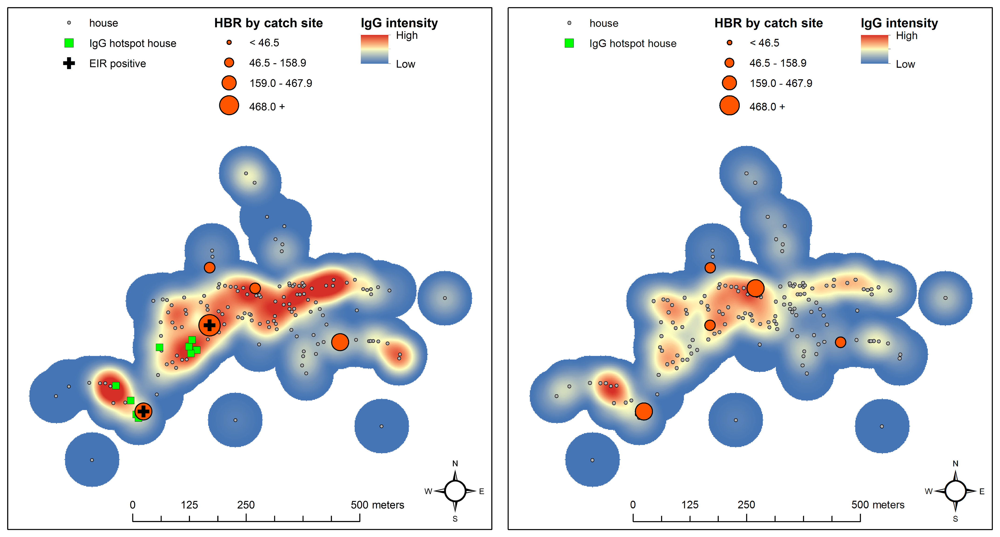
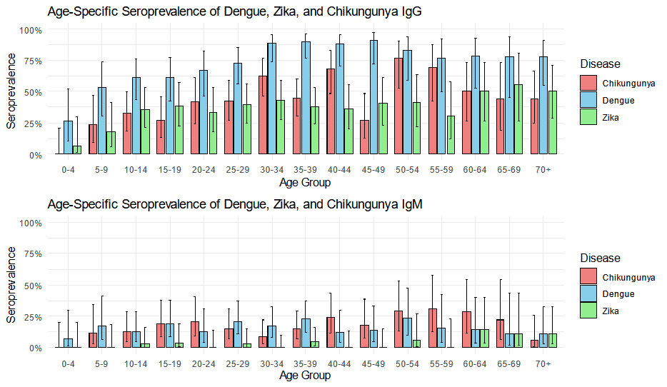

# Vector-Borne Disease Ecology

This repository curates research and conceptual framing related to the **ecological systems that shape vector-borne disease transmission**.

My work in this area examines how **vectors, environments, human exposure, and pathogens interact to shape disease risk**. The goal is to better understand transmission systems using a combination of:

- field epidemiology  
- spatial epidemiology  
- Earth observation and environmental data  
- serological markers of exposure  
- entomological sampling  
- surveillance and case data  

The diseases represented here include malaria, Aedes-borne viruses, and rickettsial infections such as scrub typhus and murine typhus.

---

## Why this repository exists

While some of my other repositories document **operational malaria programs and interventions**, the work collected here focuses primarily on **research into the ecological systems that generate transmission**.

Three related ideas motivate much of this work.

### 1. Vector ecology and human ecology intersect

Vector-borne diseases emerge where **vector ecology overlaps with human ecology**.

Understanding where mosquitoes and other vectors live, how they behave, and how humans move through those environments is essential for understanding transmission systems.

### 2. Measuring exposure to vectors is difficult

Traditional entomological measures—such as mosquito counts or biting rates—are difficult to collect and often poorly represent the **true exposure experienced by individuals**.

For this reason, some of this work explores **immunological biomarkers of vector exposure**, such as antibodies to mosquito salivary proteins. These biomarkers offer a promising way to measure how frequently individuals are bitten by mosquitoes, although important questions remain about their sensitivity, specificity, and duration of response.

### 3. Environmental drivers shape transmission systems

Environmental conditions influence both **vector populations and human exposure**, and therefore strongly shape patterns of disease.

By combining environmental data, spatial epidemiology, entomology, and serological indicators of exposure, this work aims to better understand how ecological systems produce vector-borne disease risk.

---

## Major research themes

### Vector ecology

Studies of mosquito ecology and other vector systems, including field entomology and environmental drivers of vector abundance and distribution.

### Human exposure to vectors

Research using **serological markers such as antibodies to mosquito saliva** to measure exposure to mosquito bites and other vectors.

### Serological evidence of infection

Serological surveys provide insights into **population-level exposure to vector-borne pathogens**, revealing patterns of past infection that may not be visible in routine surveillance data.

### Disease patterns and transmission

Research linking environmental conditions, human exposure, and ecological drivers to patterns of infection and disease.

Pathogen systems represented in this work include:

- malaria  
- dengue, chikungunya, and other Aedes-borne viruses  
- scrub typhus  
- murine typhus  

---

## Selected papers

The following papers illustrate different aspects of vector-borne disease ecology explored in this work.

---

### Vector exposure and immunological biomarkers

Ya-Umphan P., Cerqueira D., Parker D.M., Cottrell G., Poinsignon A., Remoue F., Brengues C., Chareonviriyaphap T., Nosten F., Corbel V. (2017).  
**Use of an Anopheles salivary biomarker to assess malaria transmission risk along the Thailand–Myanmar border.**  
*Journal of Infectious Diseases*, 215(3): 396–404.  
https://doi.org/10.1093/infdis/jiw543

Ya-Umphan P., Cerqueira D., Cottrell G., Parker D.M., Fowkes F., Nosten F., Corbel V. (2018).  
**Anopheles salivary biomarker as a proxy for estimating Plasmodium falciparum malaria exposure on the Thailand–Myanmar border.**  
*American Journal of Tropical Medicine and Hygiene*, 99(2): 350–356.  
https://doi.org/10.4269/ajtmh.18-0081

Manning J.E., Chea S., Parker D.M., Bohl J.A., Lay S., Mateja A., Man S., Nhek S., Ponce A., Sreng S., Kong D., Kimsan S., Meneses C., Fay M.P., Suon S., Huy R., Lon C., Leang R., Oliveira F. (2021).  
**Development of inapparent dengue associated with increased antibody levels to Aedes aegypti salivary proteins: a longitudinal dengue cohort in Cambodia.**  
*Journal of Infectious Diseases*.  
https://doi.org/10.1093/infdis/jiab541

Parker D.M., Medina C., Bohl J.A., Lon C., Chea S., Lay S., Kong D., Nhek S., Man S., Doehl J.S.P., Leang R., Kry H., Rekol H., Oliveira F., Minin V.M., Manning J.E. (2023).  
**Determinants of exposure to Aedes mosquitoes: a comprehensive geospatial analysis in peri-urban Cambodia.**  
*Acta Tropica*, 239: 106829.  
https://doi.org/10.1016/j.actatropica.2023.106829

These studies examine how **human antibody responses to mosquito saliva** can serve as biomarkers of exposure to vector bites and malaria or arbovirus transmission risk.

These studies examine how **human antibody responses to mosquito saliva** can serve as biomarkers of exposure to vector bites and malaria or arbovirus transmission risk.

  

*Map indicating human IgG responses to **Anopheles mosquito saliva** for a study village during the **wet season (left)** and **dry season (right)** along the Thailand–Myanmar border. The smoothed layer represents relative intensities of IgG responses, ranging from **low (dark blue)** to **medium (yellow)** to **high (dark red)**. Houses are shown as grey points, and clusters of neighbors with higher-than-expected IgG values are indicated by green squares. Human biting rates of primary malaria vectors at mosquito catch sites are shown as **dark orange graduated cylinders**. Sites where one or more primary vector mosquitoes were found carrying **malaria sporozoites** are marked with a **black cross**.  See: Ya-Umphan P. et al. (2017) *Use of an Anopheles salivary biomarker to assess malaria transmission risk along the Thailand–Myanmar border*. Journal of Infectious Diseases 215(3):396–404.  
https://doi.org/10.1093/infdis/jiw543*

---

### Serological surveillance of vector-borne pathogens

Serological studies provide another important lens on vector-borne disease ecology by measuring **population-level exposure to pathogens**.

These approaches complement entomological surveillance and case reporting by revealing patterns of past infection that may not appear in routine surveillance data.

Parker D.M., Haileselassie W., Hailemariam T.S., Workenh A., Workineh S., Wang X., Lee M.C., Yan G. (2025).  
**High seroprevalence of antibodies to dengue, chikungunya, and Zika viruses in Dire Dawa, Ethiopia: a cross-sectional survey.**  
*PLOS Neglected Tropical Diseases*.  
https://doi.org/10.1371/journal.pntd.0013357

  

*Age-specific seropositivity for **dengue, chikungunya, and Zika viruses** in Dire Dawa, Ethiopia. The **top panels show IgG seropositivity**, reflecting cumulative exposure to these arboviruses over time. The **bottom panels show IgM seropositivity**, indicating evidence of more recent infection. Age-stratified serological profiles provide insight into the **historical circulation and transmission dynamics of arboviruses**, particularly in settings where routine surveillance and laboratory confirmation are limited. See: Parker D.M. et al. (2025) *High seroprevalence of antibodies to dengue, chikungunya, and Zika viruses in Dire Dawa, Ethiopia: a cross-sectional survey.* PLOS Neglected Tropical Diseases.  
https://doi.org/10.1371/journal.pntd.0013357*

---

### Disease ecology

Roberts T., Parker D.M., Bulterys P.L., Rattanavong S., Elliott I., Phommasone K., Mayxay M., Chansamouth V., Robinson M.T., Blacksell S.D., Newton P.N. (2021).  
**A spatio-temporal analysis of scrub typhus and murine typhus in Laos: implications from changing landscapes and climate.**  
*PLOS Neglected Tropical Diseases*, 15(8): e0009685.  
https://doi.org/10.1371/journal.pntd.0009685

Rattanavong S., Dubot-Pérès A., Mayxay M., Vongsouvath M., Lee S.J., Cappelle J., Newton P.N., Parker D.M. (2020).  
**Spatial epidemiology of Japanese encephalitis virus and other infections of the central nervous system in Lao PDR (2003–2011): a retrospective analysis.**  
*PLOS Neglected Tropical Diseases*, 14(5): e0008333.  
https://doi.org/10.1371/journal.pntd.0008333

Christofferson R.C., Parker D.M., Overgaard H.J., Hii J., Devine G., Wilcox B.A., Nam V.S., Abubakar S., Boyer S., Boonnak K., Whitehead S.S., Huy R., Rithea L., Sochantha T., Wellems T.E., Valenzuela J.G. (2020).  
**Current vector research challenges in the Greater Mekong Subregion for dengue, malaria, and other vector-borne diseases: a report from a multi-sectoral workshop.**  
*PLOS Neglected Tropical Diseases*, 14(7): e0008302.  
https://doi.org/10.1371/journal.pntd.0008302

Bohl J.A., Lay S., Chea S., Ahyong V., Parker D.M., Gallagher S., Fintzi J., Man S., Ponce A., Sreng S., Kong D., Oliveira F., Kalantar K., Tan M., Fahsbender L., Sheu J., Neff N., Detweiler A.M., Yek C., Ly S., Sath R., Huch C., Kry H., Leang R., Huy R., Lon C., Tato C.M., DeRisi J.L., Manning J.E. (2022).  
**Discovering disease-causing pathogens in resource-scarce Southeast Asia using a global metagenomic pathogen monitoring system.**  
*Proceedings of the National Academy of Sciences*, 119(11): e2115285119.  
https://doi.org/10.1073/pnas.2115285119

Rijal K.R., Adhikari B., Ghimire B., Dhungel B., Pyakurel U.R., Shah P., Bastola A., Lekhak B., Banjara M.R., Pandey B.D., Parker D.M., Ghimire P. (2021).  
**Epidemiology of dengue virus infections in Nepal, 2006–2019.**  
*Infectious Diseases of Poverty*, 10: 52.  
https://doi.org/10.1186/s40249-021-00837-0

These studies link **environmental conditions, vector ecology, and human exposure** to patterns of infection and disease.

---

## Methods and tools

Some of the analytical approaches used in this work are documented in related repositories:

- [earth-observation-howto](https://github.com/parker-group/earth-observation-howto)  
- [SDEtool](https://github.com/parker-group/SDEtool)  

---

## Related repositories

These repositories document other parts of my research program:

- [earth-observation-hub](https://github.com/DMParker1/earth-observation-hub) — How EO became central to my research.  
- [activity-spaces](https://github.com/DMParker1/activity-spaces) — Multi-place exposure and health relevance.  
- [METF-mapping](https://github.com/DMParker1/METF-mapping) — Mapping malaria posts & community engagement.  
- [tMDA-program](https://github.com/DMParker1/tmda-program) — Targeted MDA trials & modeling.  
- [early-dx-tx](https://github.com/DMParker1/early-dx-tx) — Early access to malaria diagnosis/treatment.  
- [tm-border-mch](https://github.com/DMParker1/tm-border-mch) — Maternal & child health on the Thai–Myanmar border.

---

## Notes on data and collaboration

This repository does not contain sensitive data.  
Requests for data from specific projects should be directed to the relevant study teams or institutions.
